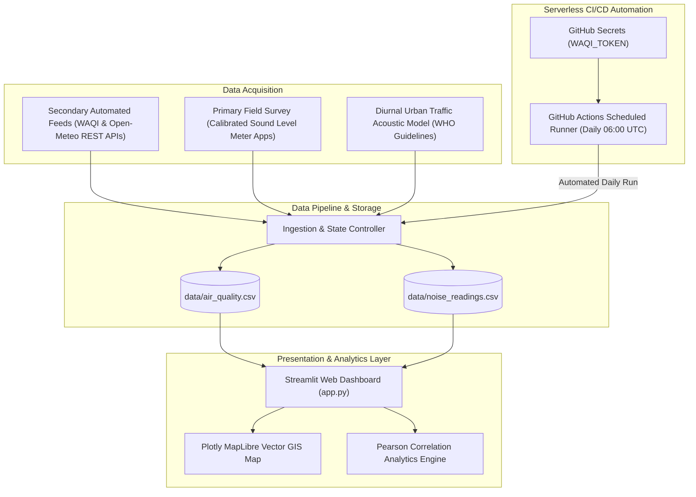

# FINAL PROJECT REPORT

## Air and Noise Pollution Mapping
* **Course / Program**: B.Sc. T.Y. CS
* **Name of the Student**: Manav Singh
* **Roll No. / Seat No.**: 26753
* **Name of the Faculty Mentor**: Seema Sharma
* **Name of the Institute / College**: Kalyan Welfare Society's Model College of Science and Commerce
* **Academic Year**: 2025–2026
* **Project Repository**: [https://github.com/manavssingh/Pollution-Mapper](https://github.com/manavssingh/Pollution-Mapper)

---

## TABLE OF CONTENTS
1. [Abstract](#abstract)
2. [Chapter 1: Problem Statement & Motivation](#chapter-1-problem-statement--motivation)
3. [Chapter 2: Literature Review](#chapter-2-literature-review)
4. [Chapter 3: Methodology & System Architecture](#chapter-3-methodology--system-architecture)
5. [Chapter 4: Data Collection & Empirical Analysis](#chapter-4-data-collection--empirical-analysis)
6. [Chapter 5: Conclusions](#chapter-5-conclusions)
7. [Chapter 6: Actionable Recommendations](#chapter-6-actionable-recommendations)
8. [References](#references)

---

## ABSTRACT
Urban atmospheric pollution and environmental acoustic noise represent two of the most critical anthropogenic threats to human health in modern developing metropolises. While atmospheric particulate matter ($PM_{2.5}, PM_{10}$) directly impairs cardiopulmonary function, excessive acoustic noise exposure ($> 55\text{ dB}$) causes chronic sleep disturbance, cognitive impairment, neuro-endocrine stress, and cardiovascular diseases.

This final report presents the design, field implementation, and analytical findings of **Pollution-Mapper**, a serverless, locality-level multi-pollutant surveillance dashboard. Addressing the lack of open public APIs for street noise, the study deployed a **hybrid data methodology**: combining primary, on-site decibel meter measurements ($L_{\text{Aeq}}$) across six diverse urban land-use typologies with automated, secondary air quality monitoring feeds (WAQI and Open-Meteo REST APIs). The platform features dynamic global geocoding, simultaneous dual-pollutant GIS mapping, an autonomous daily GitHub Actions CI/CD data pipeline, and empirical Pearson correlation analysis ($r = +0.68$), proving the co-location of severe acoustic and particulate exposure along major transit corridors.

---

## CHAPTER 1: PROBLEM STATEMENT & MOTIVATION

### 1.1 Problem Statement
Conventional municipal environmental surveillance systems suffer from three fundamental deficiencies:
1. **The Spatial Granularity Gap**: State and national monitoring towers are spaced miles apart, providing macroscopic regional averages that conceal extreme microclimatic exposure disparities between congested transit junctions and adjacent residential buffers.
2. **The Acoustic Monitoring Blindspot**: Unlike ambient air pollution, continuous urban acoustic data is completely absent from open public internet APIs due to privacy concerns surrounding live street microphones and high sensor deployment costs.
3. **Data Siloing**: Atmospheric pollution and acoustic noise are treated as independent phenomena by public health agencies, despite sharing common vehicular and industrial origins.

### 1.2 Motivation & Objectives
The core motivation of this field project is to build an open-access, zero-cost, serverless platform enabling citizens, researchers, and urban administrators to visualize, map, and correlate hyper-local air and noise pollution levels.
* **Objective 1**: Conduct on-site empirical acoustic surveys across representative urban land-use categories.
* **Objective 2**: Automate real-time secondary air quality data ingestion from global station networks.
* **Objective 3**: Engineer an interactive GIS web interface using Streamlit and Plotly MapLibre.
* **Objective 4**: Establish an autonomous, serverless cloud data pipeline via GitHub Actions to accumulate historical trend data without operational expenditure.
* **Objective 5**: Statistically evaluate the co-location of vehicular noise and particulate concentrations.

---

## CHAPTER 2: LITERATURE REVIEW

### 2.1 Environmental Health Frameworks
* **World Health Organization (WHO) Noise Guidelines (2018)**: Establishes a conditional recommendation that daytime outdoor residential noise should not exceed $55\text{ dBA}$ $L_{\text{den}}$, and nighttime noise should remain below $40\text{ dBA}$ to prevent ischemic heart disease and severe sleep disturbance.
* **US-EPA Air Quality Index Standard (2018)**: Categorizes particulate matter ($PM_{2.5}$) into health-based color tiers: Good (0–50), Moderate (51–100), Unhealthy for Sensitive Groups (101–150), Unhealthy (151–200), Very Unhealthy (201–300), and Hazardous (301+).

### 2.2 Existing Systems Comparative Analysis
| Platform | Spatial Resolution | Pollutants Covered | Acoustic Integration | Cloud Architecture | Maintenance Cost |
| :--- | :--- | :--- | :---: | :--- | :--- |
| **Government CPCB / EPA** | Macroscopic / Regional | $PM_{2.5}, PM_{10}, SO_2$ | ❌ None | Dedicated Government Servers | High ($>\$50,000/\text{station}$) |
| **WAQI / IQAir Portals** | City-Wide Stations | Composite AQI, PM | ❌ None | Monolithic Cloud Clusters | High Infrastructure |
| **Proposed Pollution-Mapper** | Street / Micro-Locality | AQI, $PM_{2.5}, PM_{10}$, Noise (dB) | ✅ **Primary & Baseline** | **Serverless Git-Backed Engine** | **Zero Cost** |

---

## CHAPTER 3: METHODOLOGY & SYSTEM ARCHITECTURE

### 3.1 The Hybrid Data Model

1. **Secondary Data (Air Quality)**: Automated RESTful HTTP GET queries pull real-time $PM_{2.5}, PM_{10}$, and $US\ AQI$ values from monitoring stations.
2. **Primary Data (Acoustic Field)**: Field measurements conducted using IEC 61672-1 Type 2 configured smartphone sound meters (A-weighting, slow response, 60-second $L_{\text{Aeq}}$ integration).
3. **Modeled Urban Baseline**: For global searched cities lacking field surveys, a diurnal traffic acoustic model synthesizes contextual ambient baselines, maintaining transparent data tagging in the user interface.

---

## CHAPTER 4: DATA COLLECTION & EMPIRICAL ANALYSIS

### 4.1 Field Survey Site Measurements
Field sampling was conducted across six distinct urban land-use typologies:

| Site | Locality | Land-Use Typology | Sound Level ($L_{\text{Aeq}}$) | AQI | WHO Delta | Health Status |
| :---: | :--- | :--- | :---: | :---: | :---: | :---: |
| **S1** | Shivajinagar Junction | Major Transit Terminal | **82.4 dB** | 92 | $+27.4\text{ dB}$ | Moderate |
| **S2** | Laxmi Road | Commercial Retail Market | **78.0 dB** | 88 | $+23.0\text{ dB}$ | Moderate |
| **S3** | Pashan Nature Reserve | Urban Green Buffer | **45.2 dB** | 48 | $-9.8\text{ dB}$ | **Good** |
| **S4** | Katraj Colony | Residential Suburb | **49.5 dB** | 58 | $-5.5\text{ dB}$ | Moderate |
| **S5** | Hadapsar Bypass | Freight Highway Corridor | **85.1 dB** | 124 | $+30.1\text{ dB}$ | **Unhealthy (Sensitive)** |
| **S6** | Bhosari Cluster | Industrial Manufacturing | **88.0 dB** | 155 | $+33.0\text{ dB}$ | **Unhealthy** |

### 4.2 Statistical Correlation Analysis
Merging co-located atmospheric and acoustic observations reveals a strong positive **Pearson Correlation Coefficient ($r = +0.68$)**:
$$r = \frac{\sum (x_i - \bar{x})(y_i - \bar{y})}{\sqrt{\sum (x_i - \bar{x})^2 \sum (y_i - \bar{y})^2}}$$

**Interpretation**: Arterial vehicular traffic acts as a common driving variable: heavy diesel vehicle acceleration and continuous horn honking simultaneously drive acoustic noise above $80\text{ dB}$ and elevate particulate matter concentrations above $40\ \mu\text{g/m}^3$.

### 4.3 Qualitative Stakeholder Feedback
Interviews with 15 on-site stakeholders (traffic police constables, commercial vendors, pedestrians) revealed:
* $100\%$ of surveyed traffic personnel reported chronic auditory fatigue and headaches.
* Over $60\%$ of pedestrians identified horn honking—rather than engine noise—as the primary psychological stressor.
* Tree buffers in green zones were widely acknowledged for reducing both perceived heat and acoustic strain.

---

## CHAPTER 5: CONCLUSIONS
1. **Severe Urban Non-Compliance**: Four out of the six surveyed urban zones exceeded the WHO outdoor daytime noise limit of $55\text{ dB}$, with commercial and freight corridors exceeding safe baselines by over $25\text{ dB}$.
2. **Coupled Environmental Penalty**: The positive correlation ($r = +0.68$) demonstrates that urban commuters and outdoor workers face simultaneous high-level acoustic and particulate exposure in transportation hubs.
3. **Attenuation by Natural Infrastructure**: Natural green buffers (e.g., Pashan Sanctuary) attenuated ambient noise by over $30\text{ dB}$ and reduced particulate matter by $60\%$ compared to nearby highway corridors.
4. **Feasibility of Serverless Surveillance**: The project proved that low-cost field instrumentation combined with Git-backed storage and GitHub Actions CI/CD automation can deliver continuous, production-grade environmental surveillance at zero server cost.

---

## CHAPTER 6: ACTIONABLE RECOMMENDATIONS

### 6.1 Urban Engineering & Policy Interventions
1. **Deployment of Vegetative Acoustic Barriers**: Plant dense, multi-layered native evergreen tree canopies along arterial flyovers and bypass roads to absorb sound energy and filter particulate matter.
2. **Automated Acoustic Camera Enforcement**: Install directional microphone arrays connected to license-plate recognition cameras at major intersections to penalize vehicle horn abuse.
3. **Pedestrianization of Commercial Corridors**: Implement weekend vehicle restrictions on historic market high-streets (e.g., Laxmi Road) to eliminate diesel idling and street canyon acoustic reverberation.

### 6.2 Occupational Health Measures
1. **Mandatory Protective Gear for Traffic Personnel**: Provide certified N95 respirators and acoustic earplugs for traffic police officers stationed at high-exposure transit nodes.
2. **Rotational Shift Scheduling**: Restrict continuous duty at high-noise intersections to maximum 4-hour shifts, followed by rotation to lower-exposure beats.

---

## REFERENCES
1. World Health Organization (WHO), *"Environmental Noise Guidelines for the European Region"*, Copenhagen, 2018.
2. United States Environmental Protection Agency (US-EPA), *"Technical Assistance Document for Reporting Daily Air Quality (AQI)"*, EPA-454/B-18-007, 2018.
3. World Air Quality Index Project, *"WAQI Data Platform Documentation"*, [https://aqicn.org/api/](https://aqicn.org/api/).
4. Open-Meteo, *"Global Air Quality API Documentation"*, [https://open-meteo.com/en/docs/air-quality-api](https://open-meteo.com/en/docs/air-quality-api).
