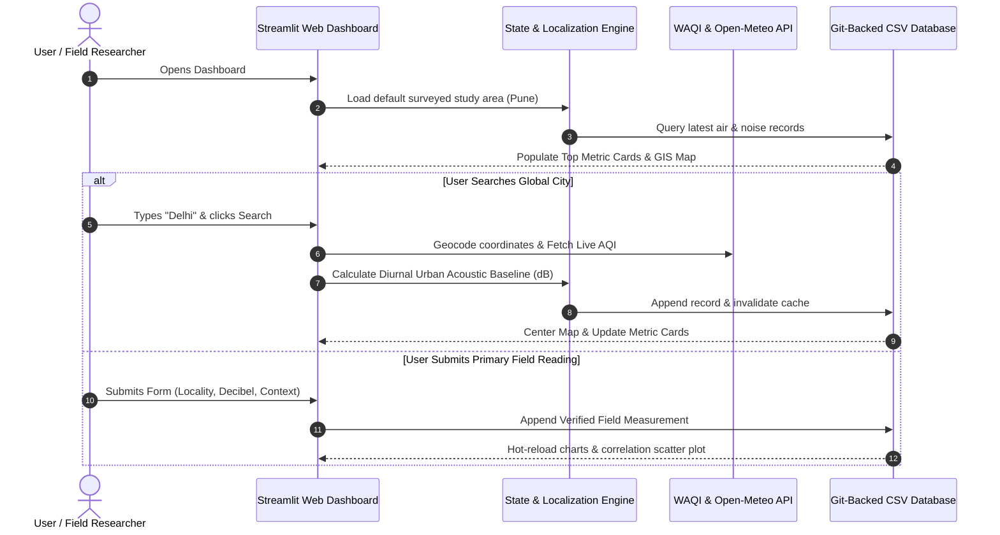

# PROJECT PLANNING & DESIGN DOCUMENT

## Locality-Level Air and Noise Pollution Mapping Dashboard
* **Document Type**: Project Planning, Instrumentation Design, and Survey Protocol
* **Domain**: Environmental Informatics, Human-Computer Interaction (HCI), Field Research Design
* **Project Repository**: [https://github.com/manavssingh/Pollution-Mapper](https://github.com/manavssingh/Pollution-Mapper)

---

## 1. PROJECT CHARTER & SCOPE
* **Project Objective**: To engineer a low-cost, serverless, locality-level environmental monitoring dashboard integrating automated API air quality feeds with primary decibel meter field readings and diurnal urban acoustic models.
* **Target Stakeholders**: Academic evaluators, municipal environmental planners, local citizens, traffic enforcement personnel, and public health researchers.
* **Geographical Scope**: Primary field baseline surveyed across the Pune Metropolitan Corridor; architectural capability designed for on-demand global city search and surveillance.

---

## 2. SURVEY INSTRUMENTATION & CALIBRATION PROTOCOLS

### 2.1 Primary Acoustic Survey Instrument (Smartphone Sound Meter)
* **Application Specifications**: Decibel X / Sound Meter Pro (IEC 61672-1 Type 2 compliance configuration).
* **Calibration Procedure**:
  1. **Acoustic Weighting Filter**: Set to **A-Weighting (dBA)** to mimic the frequency sensitivity of the human auditory system.
  2. **Dynamic Response Mode**: Set to **Slow (1000 ms time constant)** to capture stable continuous equivalent sound pressure levels ($L_{\text{Aeq}}$) rather than isolated transient spikes.
  3. **Baseline Zeroing**: Reference calibration verified in a quiet interior environment ($< 32\text{ dBA}$) prior to field departure.
  4. **Microphone Placement**: Device oriented at a 45-degree angle towards the noise source, held 1.3 meters above ground level, with a foam wind-guard attached to reduce aerodynamic turbulence.

### 2.2 Secondary Atmospheric Data Ingestion Engine
* **REST APIs Utilized**:
  * **WAQI (World Air Quality Index) API**: Station-level EPA-standardized Air Quality Index and particulate breakdowns.
  * **Open-Meteo Global Air Quality API**: Worldwide spatial atmospheric model providing real-time $PM_{2.5}, PM_{10}$, and $US\ AQI$ at arbitrary coordinate resolutions.
  * **OpenStreetMap Nominatim Geocoder**: Reverse and forward geocoding engine mapping query strings into latitude-longitude pairs.

---

## 3. QUALITATIVE SURVEY INSTRUMENT: FIELD INTERVIEW QUESTIONNAIRE

Below is the standardized 10-question survey instrument utilized during on-site field visits with local pedestrians, commercial shopkeepers, and traffic personnel:

### Section A: Demographic & Location Context
1. **Participant Category**: `[ ] Pedestrian / Commuter` `[ ] Local Shopkeeper / Street Vendor` `[ ] Traffic Police Officer` `[ ] Resident`
2. **Daily Exposure Duration at this Site**: `[ ] < 1 hour` `[ ] 1–4 hours` `[ ] 4–8 hours` `[ ] > 8 hours`

### Section B: Perceived Environmental Quality
3. **How would you rate the general air quality at this location today?**
   `[ ] 1 - Very Clean` `[ ] 2 - Acceptable` `[ ] 3 - Moderate / Dusty` `[ ] 4 - Poor / Smoggy` `[ ] 5 - Unbearable`
4. **How would you rate the acoustic noise level at this location right now?**
   `[ ] 1 - Quiet / Peaceful` `[ ] 2 - Normal Conversation` `[ ] 3 - Noticeably Loud` `[ ] 4 - Uncomfortably Loud` `[ ] 5 - Deafening / Painful`
5. **What do you perceive as the single largest contributor to noise at this spot?**
   `[ ] Continuous vehicular horns` `[ ] Heavy diesel bus / truck engines` `[ ] Construction / Machinery` `[ ] Loudspeakers / Vendor calls` `[ ] Other`

### Section C: Health Symptoms & Physiological Impact
6. **Do you experience any of the following symptoms during or immediately after spending time here? (Select all that apply)**
   `[ ] Headache / Dizziness` `[ ] Ringing in ears (Tinnitus)` `[ ] Throat irritation / Dry cough` `[ ] Eye watering` `[ ] Irritability / Stress` `[ ] None`
7. **Do you currently wear any protective equipment (e.g. mask, earplugs) while at this location?**
   `[ ] Yes, certified N95 mask` `[ ] Yes, cloth/surgical mask` `[ ] No protection used`

### Section D: Community Awareness & Mitigation Preferences
8. **Are you aware of the World Health Organization (WHO) daytime safe outdoor noise limit of 55 dB?**
   `[ ] Yes` `[ ] No`
9. **Which intervention would you most recommend for this specific locality?**
   `[ ] Stricter anti-honking enforcement & fines` `[ ] Physical green tree barriers & vegetative buffers` `[ ] Heavy truck diversion / Bypass rerouting` `[ ] Pedestrian-only zones`
10. **Would a public interactive map showing real-time air and noise levels influence your travel route or housing decisions?**
    `[ ] Definitely Yes` `[ ] Somewhat` `[ ] No impact`

---

## 4. FIELD DATA COLLECTION PLAN & EXECUTION SCHEDULE

### 4.1 Spatial Sampling Matrix
The sampling plan targets 6 representative land-use typologies across the urban gradient:

| Zone Code | Typology | Sampling Rationale | Target Sites |
| :---: | :--- | :--- | :--- |
| **Z-1** | Transit / Arterial Corridor | Maximum vehicular acceleration, bus idling, and pedestrian transit | Shivajinagar Junction |
| **Z-2** | Commercial Retail High-Street | Narrow street canyons with reverberant noise and retail footfall | Laxmi Road |
| **Z-3** | Ecological Park / Water Buffer | Baseline control zone measuring vegetative sound attenuation | Pashan Nature Reserve |
| **Z-4** | Residential Suburb | Testing residential compliance with WHO 55 dB daytime guidelines | Katraj Lake Colony |
| **Z-5** | Freight Highway Bypass | Multi-axle commercial vehicle transit and heavy particulate dust | Hadapsar Gadital Bypass |
| **Z-6** | Industrial Manufacturing Cluster| Continuous mechanical processing noise and localized point emissions | Bhosari Industrial Estate |

### 4.2 Diurnal Sampling Schedule
To observe temporal environmental dynamics, each site is sampled across four standard temporal intervals:
* **T1: Morning Rush (07:30 – 09:30 AM)**: Commuter vehicular peaks and school bus transit.
* **T2: Midday Commercial (01:00 – 03:00 PM)**: Baseline steady-state operations and delivery transport.
* **T3: Evening Peak (05:30 – 07:30 PM)**: Congestion peaks and retail footfall.
* **T4: Night Baseline (09:30 – 11:00 PM)**: Freight bypass entry and residential quietude.

---

## 5. APP ARCHITECTURE, PROTOTYPES & WIREFRAME DESIGN

### 5.1 System Workflow Diagram


### 5.2 UI/UX Prototype Layout
The dashboard layout is engineered into five responsive viewports:

```
+-------------------------------------------------------------------------+
|  [Sidebar]                  🌍 AIR & NOISE POLLUTION DASHBOARD          |
|  - Refresh Data             Locality Environmental Surveillance Portal  |
|  - Jump to My Location     +------------------------------------------+ |
|  - Submit Noise Form       | 🔍 Search ANY City: [ e.g. London ] [Go]  | |
|    * Locality Name         +------------------------------------------+ |
|    * Lat / Lon             | 📍 Focused Locality: Shivajinagar Junction |
|    * Decibel Slider        +------------------------------------------+ |
|    * Time of Day           | [Card 1: Active] | [Card 2: AQI: 92]     | |
|    * Notes / Context       | [Card 3: 82 dB]  | [Card 4: Health Alert]| |
|                            +------------------------------------------+ |
|                            | INTERACTIVE GEOGRAPHIC SCATTER MAP       | |
|                            | (Combined / Air AQI / Noise dB Layers)   | |
|                            | [ OpenStreetMap MapLibre Layer ]         | |
|                            +------------------------------------------+ |
|                            | [Chart A: AQI Bar] | [Chart B: Noise Bar]| |
|                            +------------------------------------------+ |
|                            | 🔬 CORRELATION ANALYSIS (Noise vs. AQI)  | |
|                            | Scatter Plot with Pearson 'r' Metric     | |
|                            +------------------------------------------+ |
|                            | 📖 REFERENCE SCALES (WHO Noise & US-EPA) | |
|                            | 📊 RAW DATA TABLES & CSV EXPORT BUTTONS  | |
+-------------------------------------------------------------------------+
```

---

## 6. TRAINING MODULE OUTLINE FOR FIELD VOLUNTEERS

To scale primary crowd-sourced environmental monitoring across student groups, a standardized 3-step training syllabus is established:

* **Module 1: Acoustic Measurement Protocols (45 Mins)**
  * Understanding sound pressure level (dB), A-weighting scales, and logarithmic summing.
  * Correct device positioning: Avoiding wind turbulence, hand tremors, and proximity to wall reflections.
  * Recording $L_{\text{Aeq}}$ over 60-second observation intervals.
* **Module 2: Interviewing & Stakeholder Engagement (30 Mins)**
  * Ethical conduct: Obtaining verbal consent before conducting public surveys.
  * Administering the 10-question questionnaire without introducing leading bias.
  * Respecting participant privacy (no recording of personal identifiable names or contact info).
* **Module 3: Data Integrity & Platform Upload (30 Mins)**
  * Cross-verifying coordinate accuracy via Google Maps pins.
  * Direct data contribution via the dashboard's sidebar submission form.
  * Tagging data sources accurately (*Field Measurement* vs *Estimated Baseline*).
