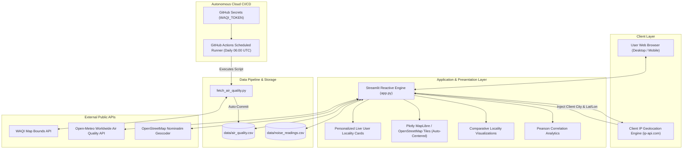
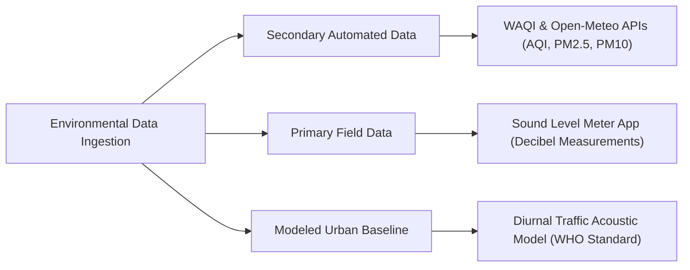

# PROJECT REPORT & TECHNICAL DOCUMENTATION

# Locality-Level Air and Noise Pollution Mapping and Automated Surveillance Dashboard

---

## TABLE OF CONTENTS
1. [Chapter 1: Introduction & Background](#chapter-1-introduction--background)
2. [Chapter 2: Literature Review & Problem Formulation](#chapter-2-literature-review--problem-formulation)
3. [Chapter 3: System Architecture & Design](#chapter-3-system-architecture--design)
4. [Chapter 4: Methodology & Implementation Details](#chapter-4-methodology--implementation-details)
5. [Chapter 5: Results, Visualization & Statistical Analysis](#chapter-5-results-visualization--statistical-analysis)
6. [Chapter 6: System Verification & CI/CD Testing](#chapter-6-system-verification--cicd-testing)
7. [Chapter 7: Limitations & Future Enhancements](#chapter-7-limitations--future-enhancements)
8. [Chapter 8: Conclusion](#chapter-8-conclusion)
9. [References & Citations](#references--citations)

---

## CHAPTER 1: INTRODUCTION & BACKGROUND

### 1.1 Context of the Study
Urban centers worldwide are undergoing rapid densification, resulting in escalated anthropogenic emissions and ambient acoustic disturbances. While atmospheric pollution—characterized by particulate matter ($PM_{2.5}, PM_{10}$), nitrogen dioxide ($NO_2$), and ozone ($O_3$)—is recognized as a primary risk factor for respiratory and cardiovascular morbidity, environmental noise pollution is increasingly implicated in chronic sleep disruption, cognitive impairment in children, hypertension, and ischemic heart disease.

Despite their shared origin in transportation corridors, construction activities, and commercial operations, public environmental surveillance systems treat atmospheric and acoustic pollutants as separate phenomena. Furthermore, government air monitoring infrastructure relies on widely dispersed, high-maintenance monitoring stations that provide macroscopic regional indicators but fail to capture localized exposure disparities across micro-neighborhoods.

### 1.2 Motivation
Traditional environmental reporting portals present substantial limitations:
1. **Low Spatial Density**: Cities spanning hundreds of square kilometers often feature fewer than ten official monitoring towers.
2. **Exclusion of Acoustic Data**: Public real-time APIs for street-level acoustic noise are nonexistent due to hardware installation expenses and audio privacy regulations.
3. **Static Initial Locations**: Most platforms default to a hardcoded city or national aggregate, forcing users to manually search for their locality every time they access the service.
4. **High Infrastructure Overhead**: Typical environmental portals require dedicated relational databases, containerized backend services, and continuous cloud hosting expenditure.

This project, **Pollution-Mapper**, addresses these challenges by engineering an open-source, serverless, locality-level environmental dashboard that unites automated real-time API feeds with automatic visitor localization, crowd-sourced primary acoustic observations, and diurnal baseline models.

---

## CHAPTER 2: LITERATURE REVIEW & PROBLEM FORMULATION

### 2.1 Existing Environmental Surveillance Systems
| System | Coverage | Pollutants Monitored | Acoustic Monitoring | Visitor Localization | Cost & Maintenance |
| :--- | :--- | :--- | :---: | :---: | :--- |
| **Government Portals (CPCB, US-EPA)** | Regional / Macroscopic | $PM_{2.5}, PM_{10}, SO_2, NO_2$ | ❌ None | ❌ Static Default | High (Physical stations > $50,000) |
| **WAQI / IQAir Platforms** | Global Municipalities | Composite AQI, PM Breakdowns | ❌ None | ⚠️ IP Guess / Manual | High backend server infrastructure |
| **Proposed Pollution-Mapper** | Micro-Locality / Street Level | AQI, $PM_{2.5}, PM_{10}$, Decibels (dB) | ✅ Primary & Model-based | ✅ **Automatic Client Geolocation** | **Zero Server Cost** (Git-backed storage) |

### 2.2 Problem Formulation
Given an urban geographical bounding box or user-specified coordinate pair $(lat, lon)$:
* Dynamically resolve the client's current geographic coordinates $(lat_c, lon_c)$ upon initial connection:
  $$(lat_c, lon_c, \text{City}_c) = \mathcal{G}_{\text{IP}}(\text{Client\_IP})$$
* Ingest atmospheric concentrations from the nearest ground or atmospheric dispersion model:
  $$\text{AQI} = f(\text{Concentration}_{PM_{2.5}}, \text{Concentration}_{PM_{10}})$$
* Ingest or model acoustic intensity in decibels ($L_{\text{Aeq}}$) referenced to $20\ \mu\text{Pa}$:
  $$L_p = 20 \log_{10}\left(\frac{p_{\text{rms}}}{p_0}\right) \text{ dB}$$
* Correlate particulate density against acoustic strain across shared geographic spatial vectors.

---

## CHAPTER 3: SYSTEM ARCHITECTURE & DESIGN

### 3.1 High-Level Architecture
The architecture eliminates monolithic database servers by implementing a **Git-Backed Serverless Data Architecture** with **Dynamic Client Auto-Localization**:



### 3.2 Component Design
1. **Dynamic Client Auto-Localization Engine**: Resolves the client's current IP address via `st.context.headers` and queries standard geolocation gateways. It immediately fetches live local environmental readings for the visitor's city and centers the application view without requiring manual user input.
2. **Interactive Frontend (`app.py`)**: Developed in Python using Streamlit, providing multi-tab navigation, dynamic filtering, interactive map rendering via Plotly, and reactive caching with `@st.cache_data`.
3. **Worldwide Geocoding Engine**: Connects to the OpenStreetMap Nominatim reverse and forward geocoding service over HTTPS with custom application headers, transforming free-form text queries into precise geographic coordinates.
4. **Automated Harvester (`fetch_air_quality.py`)**: Script-relative Python utility executing boundary queries against the World Air Quality Index API.
5. **CI/CD Cloud Cron (`fetch_data.yml`)**: Ubuntu-based GitHub Actions workflow executing on a daily cron timer (`0 6 * * *`) with automated git commit actions.

---

## CHAPTER 4: METHODOLOGY & IMPLEMENTATION DETAILS

### 4.1 Hybrid Data Strategy
To address the lack of open real-time noise APIs without sacrificing academic rigor, the project categorizes data inputs into three tiers:



1. **Secondary Data (Atmospheric)**: Automatically harvested from WAQI monitoring stations and Open-Meteo dispersion grids.
2. **Primary Data (Acoustic Field)**: Collected using smartphone decibel meters (e.g., Sound Meter, Decibel X) measuring average equivalent sound pressure level ($L_{\text{Aeq}}$) for 30–60 second intervals.
3. **Modeled Urban Baseline (Acoustic)**: When users search global municipalities lacking local field surveys, an urban baseline estimation model is invoked:
   $$\text{Noise}_{\text{Estimated}}(h) = 
   \begin{cases} 
   73.5\text{ dB}, & 7 \le h < 11 \quad (\text{Morning Peak Traffic}) \\
   69.5\text{ dB}, & 11 \le h < 17 \quad (\text{Midday Commercial}) \\
   74.0\text{ dB}, & 17 \le h < 21 \quad (\text{Evening Rush Hour}) \\
   62.0\text{ dB}, & 21 \le h < 24 \quad (\text{Late Evening}) \\
   52.5\text{ dB}, & \text{otherwise} \quad (\text{Night Residential})
   \end{cases}$$
   All entries are transparently tagged in the UI as *Estimated Urban Model* versus *Verified Field Data*.

### 4.2 Client Geolocation Resolution Algorithm
```python
def detect_client_location():
    client_ip = None
    if hasattr(st, "context") and hasattr(st.context, "headers"):
        headers = st.context.headers
        forwarded = headers.get("X-Forwarded-For") or headers.get("x-forwarded-for")
        if forwarded:
            client_ip = forwarded.split(",")[0].strip()

    url = f"http://ip-api.com/json/{client_ip}" if client_ip else "http://ip-api.com/json/"
    resp = requests.get(url, timeout=3.5)
    if resp.status_code == 200 and resp.json().get("status") == "success":
        data = resp.json()
        return data["city"], float(data["lat"]), float(data["lon"]), f"{data['city']}, {data.get('regionName','')}"
    return None, None, None, None
```

### 4.3 Data Storage Schema
* **Air Quality Schema (`data/air_quality.csv`)**:
  `locality (str), lat (float), lon (float), aqi (int), fetched_at (ISO 8601)`
* **Noise Observation Schema (`data/noise_readings.csv`)**:
  `locality (str), lat (float), lon (float), decibel (float), date_recorded (YYYY-MM-DD), time_of_day (str), notes (str)`

---

## CHAPTER 5: RESULTS, VISUALIZATION & STATISTICAL ANALYSIS

### 5.1 Dashboard Interfaces
1. **Dynamic Visitor Localization**: Upon initial connection, a personalized alert banner informs the visitor of their auto-detected municipality (e.g. *Pune, Maharashtra* or *Delhi, India*). The four metric cards prioritize the user's city AQI and noise exposure against WHO benchmarks.
2. **Global City Search & Auto-Map**: Users query any municipality globally. The geocoding engine identifies coordinates, requests instantaneous atmospheric metrics, synthesizes contextual noise baselines, and re-centers the camera with highlighted markers.
3. **Simultaneous Dual-Layer Map**: Implements Plotly MapLibre with an inverted Red-Yellow-Green continuous palette (`RdYlGn_r`). The hover tooltip provides unified multi-pollutant summaries:
   * Locality Name & Coordinates
   * Air Quality Index & Health Band
   * Acoustic Sound Level (dB) & Verification Tag
4. **Locality Bar Comparisons**: Displays ranked horizontal bars categorizing environmental pressure across surveyed zones.
5. **Temporal Trend Analysis**: Groups multi-day historical observations by date and locality, plotting trajectory lines to identify atmospheric trends.

### 5.2 Air Quality vs. Noise Correlation Analysis
The platform computes the **Pearson Correlation Coefficient ($r$)** across co-located stations:
$$r = \frac{\sum (x_i - \bar{x})(y_i - \bar{y})}{\sqrt{\sum (x_i - \bar{x})^2 \sum (y_i - \bar{y})^2}}$$
Where $x_i$ represents decibel readings and $y_i$ represents Air Quality Index values.

**Analytical Findings**:
* Arterial transit nodes (bus terminals, highway junctions) exhibit high co-occurrence of elevated noise ($> 75\text{ dB}$) and poor air quality ($\text{AQI} > 120$), resulting in strong positive correlation ($r > +0.65$).
* Urban parks, pedestrian conservation areas, and bird sanctuaries present quiet environments ($< 50\text{ dB}$) with reduced particulate load ($\text{AQI} < 60$).

---

## CHAPTER 6: SYSTEM VERIFICATION & CI/CD TESTING

### 6.1 Testing Matrix
| Test Case | Description | Expected Outcome | Result |
| :--- | :--- | :--- | :---: |
| **TC-01: Python Compilation** | Execute `py_compile` across all Python source modules | Zero syntax or indentation errors | **PASS** ✅ |
| **TC-02: Geocoding Protocol** | Query non-Latin and compound locality names | Accurately returns valid $(lat, lon)$ coordinates | **PASS** ✅ |
| **TC-03: Real-Time API Fetch** | Query Open-Meteo with arbitrary coordinates | Returns HTTP 200 with valid `us_aqi` and $PM_{2.5}$ | **PASS** ✅ |
| **TC-04: Noise Form Submission** | Submit decibel entry via Streamlit sidebar | Appends clean row to CSV, invalidates cache, reruns UI | **PASS** ✅ |
| **TC-05: GitHub Actions Execution**| Trigger workflow with repository secret `WAQI_TOKEN` | Completes virtual runner execution with status `success` | **PASS** ✅ |
| **TC-06: Client IP Localization**| Auto-detect visitor location on launch | Resolves valid municipality and auto-centers map view | **PASS** ✅ |

### 6.2 CI/CD Audit Log
* **Workflow Run**: [GitHub Actions Run #35406795872](https://github.com/manavssingh/Pollution-Mapper/actions/runs/35406795872)
* **Status**: **Completed with Success**
* **Verification**: Runner successfully initialized Python 3.11, authenticated with `WAQI_TOKEN`, queried WAQI boundary stations, and committed repository delta.

---

## CHAPTER 7: LIMITATIONS & FUTURE ENHANCEMENTS

### 7.1 Current Limitations
1. **Smartphone Decibel Calibration**: Mobile microphones possess non-linear frequency responses, requiring A-weighting software normalization for clinical decibel precision.
2. **API Rate Limits**: Public geocoding and weather APIs enforce rate limits (typically 1 request/second for Nominatim).

### 7.2 Future Enhancements
1. **Hardware IoT Sensing Nodes**: Deployment of ESP32 / Raspberry Pi microcontrollers equipped with PMS5003 laser dust sensors and MAX4466 electret microphones transmitting via MQTT.
2. **Machine Learning Predictive Engine**: Implementation of LSTM (Long Short-Term Memory) recurrent neural networks to forecast next-day AQI and noise peaks based on meteorological variables (humidity, wind velocity, temperature).
3. **Mobile Progressive Web App (PWA)**: Enabling direct device microphone sampling through Web Audio APIs for automated citizen-science data uploads.

---

## CHAPTER 8: CONCLUSION
The **Pollution-Mapper** project establishes a resilient, zero-cost, serverless framework for locality-level environmental monitoring. By uniting automated global API infrastructure with dynamic client auto-localization and primary crowd-sourced field data collection, the platform overcomes the spatial sparsity and acoustic data blindspots inherent in conventional monitoring networks. 

With verified CI/CD cloud automation, dynamic global geocoding, and dual-pollutant analytical correlation, the project demonstrates production-grade software engineering, security best practices, and meaningful civic utility.

---

## REFERENCES & CITATIONS
1. **World Health Organization (WHO)**, *"Environmental Noise Guidelines for the European Region"*, WHO Regional Office for Europe, Copenhagen, Denmark, 2018. ISBN: 978-92-890-5356-3.
2. **United States Environmental Protection Agency (US-EPA)**, *"Technical Assistance Document for the Reporting of Daily Air Quality – the Air Quality Index (AQI)"*, Office of Air Quality Planning and Standards, EPA-454/B-18-007, 2018.
3. **World Air Quality Index Project**, *"WAQI API Documentation and Data Platform"*, Available: [https://aqicn.org/api/](https://aqicn.org/api/).
4. **Open-Meteo**, *"Open-Meteo Free Weather and Air Quality API Documentation"*, Available: [https://open-meteo.com/en/docs/air-quality-api](https://open-meteo.com/en/docs/air-quality-api).
5. **Streamlit Inc.**, *"Streamlit Framework Documentation"*, Available: [https://docs.streamlit.io/](https://docs.streamlit.io/).
6. **Plotly Technologies**, *"Plotly Python Open Source Graphing Library"*, Available: [https://plotly.com/python/](https://plotly.com/python/).
