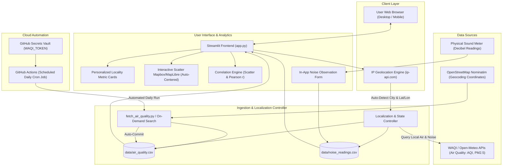

# PROJECT SYNOPSIS

## 1. PROJECT TITLE
**Air and Noise Pollution Mapping**

---

## 2. CANDIDATE & INSTITUTIONAL DETAILS
* **Name of the Student**: Manav Singh
* **Roll No. / Seat No.**: 26753
* **Class / Program**: B.Sc. T.Y. CS
* **Name of the Faculty Mentor**: Seema Sharma
* **Name of the Institute / College**: Kalyan Welfare Society's Model College of Science and Commerce
* **Academic Year**: 2025–2026
* **Domain**: Environmental Informatics, Data Science, Geographic Information Systems (GIS), Cloud Automation
* **Project Repository**: [https://github.com/manavssingh/Pollution-Mapper](https://github.com/manavssingh/Pollution-Mapper)

---

## 3. ABSTRACT
Rapid urban industrialization and vehicle density have escalated both atmospheric pollution and acoustic noise into critical public health crises. Conventional municipal monitoring systems deploy centralized, expensive physical stations that capture regional averages but obscure hyper-local environmental hotspots. Furthermore, public data infrastructure heavily isolates air quality metrics from acoustic pollution indices, ignoring their shared anthropogenic sources such as vehicular traffic and industrial operations.

This project introduces **Pollution-Mapper**, an interactive, serverless, locality-level environmental dashboard. It implements a novel **hybrid data collection architecture**:
1. **Automated Client Auto-Localization**: Automatic detection of the visitor's live geographic position (city and coordinates via IP geolocation) upon launching the application, instantly personalizing the dashboard and map to their immediate locality.
2. **Secondary Atmospheric Data**: Automated ingestion of real-time air quality metrics (AQI, PM2.5, PM10) from global monitoring networks via RESTful APIs.
3. **Primary Acoustic Data**: Crowd-sourced and field-recorded acoustic decibel (dB) measurements collected using calibrated smartphone sound meters, augmented with diurnal WHO urban traffic baseline estimations for unmonitored global localities.

The system features global on-demand geocoding, simultaneous dual-pollutant GIS mapping, statistical correlation analysis, and an autonomous GitHub Actions CI/CD data pipeline that captures daily historical trends without manual server management.

---

## 4. PROBLEM STATEMENT & MOTIVATION
* **Spatial Granularity Gap**: Traditional government environmental monitoring stations are spaced tens of kilometers apart. Exposure varies sharply between a high-density transit junction and an adjacent urban park located 500 meters away.
* **Acoustic Data Blindspot**: Unlike particulate matter, continuous urban noise data is seldom available through open public internet APIs due to privacy concerns and high sensor infrastructure costs.
* **Static Locality Problem**: Standard environmental dashboards force fixed, hardcoded locations upon initial visit. Users require instantaneous, friction-free localization to their immediate surroundings.
* **Operational Overhead**: Standard data visualization portals require dedicated backend web servers, database maintenance, and recurring operational costs.

**Motivation**: To engineer a low-cost, zero-maintenance, open-access platform enabling researchers, civic planners, and citizens to visualize, map, and correlate localized air and noise pollution levels tailored directly to their live position anywhere in the world.

---

## 5. OBJECTIVES OF THE PROJECT
1. **Dynamic Client Auto-Localization**: Implement automated visitor geolocation that instantly identifies the user's city/region upon initial load and centers all environmental metrics, maps, and advisories on their area.
2. **Develop an Interactive GIS Web Application**: Build a responsive dashboard using Streamlit and Plotly to map multi-pollutant indicators over open-access map tiles.
3. **Implement Worldwide On-Demand Geocoding**: Allow instantaneous searching of any global city or neighborhood using OpenStreetMap Nominatim and real-time environmental APIs.
4. **Establish a Dual Primary & Secondary Data Ingestion Model**: Unify automated external air quality feeds with physical sound-meter primary observations and validated WHO acoustic baseline models.
5. **Engineer an Autonomous Cloud Data Pipeline**: Implement GitHub Actions cron workflows with encrypted secrets management to automatically fetch, parse, and commit longitudinal data daily.
6. **Conduct Multi-Pollutant Correlation Analysis**: Calculate the Pearson correlation coefficient between acoustic noise and particulate pollution to evaluate joint environmental exposure.

---

## 6. SYSTEM ARCHITECTURE & METHODOLOGY

### 6.1 Architectural Workflow

### 6.2 Data Strategy
* **Live Visitor Position**: Automatically resolved using client IP address lookup on application launch, fetching current atmospheric readings and synthesizing a contextual ambient noise baseline.
* **Air Quality**: Sourced from EPA/WAQI monitoring stations and Open-Meteo atmospheric dispersion feeds.
* **Acoustic Noise**: Captured via calibrated mobile sound level meters (30–60 second Leq samples) categorized by diurnal time intervals (Morning, Afternoon, Evening, Night).
* **Validation**: Dual data records are transparently classified into *Verified Field Data* vs. *Estimated Urban Model* to ensure academic integrity.

---

## 7. HARDWARE & SOFTWARE SPECIFICATIONS

### Hardware Requirements
* **Processor**: Dual Core 2.0 GHz or higher (Intel Core i3/i5/i7, AMD Ryzen, Apple Silicon M-series)
* **RAM**: 4 GB minimum (8 GB recommended)
* **Storage**: 500 MB available disk space
* **Network**: Broadband internet connection for real-time API queries, geolocation lookup, and map rendering
* **Field Sensor**: Android or iOS smartphone with a decibel meter application (e.g., Decibel X, Sound Meter)

### Software Requirements
* **Operating System**: macOS, Linux (Ubuntu/Debian), or Windows 10/11
* **Runtime Environment**: Python 3.10+
* **Core Libraries**:
  * `streamlit >= 1.38`: Reactive web interface and state management
  * `pandas >= 2.0`: Time-series dataframe indexing, cleaning, and aggregation
  * `plotly >= 5.24`: Interactive MapLibre geographic scatter maps and statistical plots
  * `requests >= 2.31`: Asynchronous HTTP protocol queries
* **Version Control & CI/CD**: Git, GitHub, GitHub Actions
* **Hosting / Cloud**: Streamlit Community Cloud (Zero-cost deployment)

---

## 8. EXPECTED OUTCOMES
1. A live, publicly accessible environmental dashboard providing hyper-local resolution tailored to the visitor's live location.
2. Immediate auto-centering of geographic maps and metric indicators based on the user's detected municipality.
3. Capability to search and map any municipality globally with real-time AQI and contextual acoustic indices.
4. Automated longitudinal dataset expansion through cloud-scheduled data harvesting.
5. Statistical insight into the co-location of vehicular noise and atmospheric particulate concentrations.
6. Exportable open data formats (CSV) for downstream academic and municipal research.

---

## 9. APPLICATIONS & SOCIETAL SIGNIFICANCE
* **Personal Environmental Health**: Instantly alerts visitors to current atmospheric and acoustic health risks in their immediate vicinity.
* **Civic Health & Urban Planning**: Enables municipal bodies to identify noise-pollution corridors and target low-emission zones or noise barriers.
* **Real Estate & Residential Assessment**: Informs home-buyers and tenants of microclimatic environmental quality prior to relocation.
* **Academic & Environmental Research**: Provides a reproducible, open-source model for cost-effective crowd-sourced pollution monitoring in developing nations.

---

## 10. REFERENCES
1. World Health Organization (WHO), *"Environmental Noise Guidelines for the European Region"*, Regional Office for Europe, Copenhagen, 2018.
2. United States Environmental Protection Agency (US-EPA), *"Technical Assistance Document for the Reporting of Daily Air Quality – the Air Quality Index (AQI)"*, EPA-454/B-18-007, 2018.
3. World Air Quality Index Project, *"WAQI Data Platform API Documentation"*, [https://aqicn.org/api/](https://aqicn.org/api/), 2026.
4. Open-Meteo, *"Global Air Quality API Documentation"*, [https://open-meteo.com/en/docs/air-quality-api](https://open-meteo.com/en/docs/air-quality-api), 2026.
